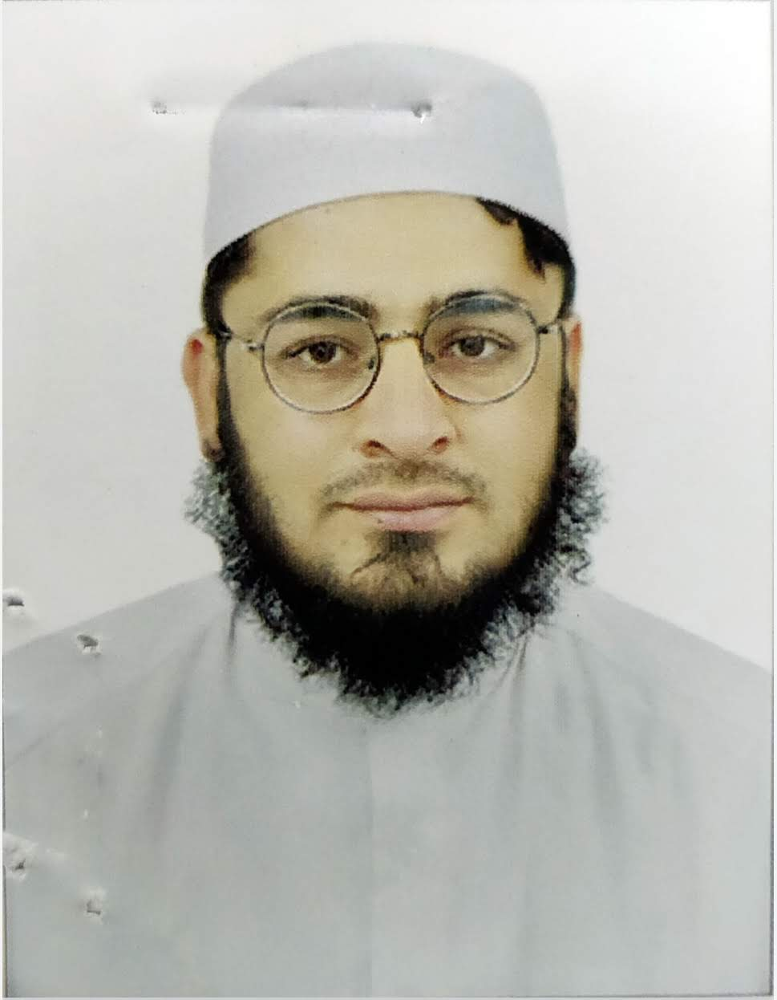

<!--  -->

# Dr. Adnan Farooq

## Personal Information
- **Address**: Moh: Maroof Abad, Vill: Urmal Dheri, P/O: Yar Hussain, Teh: Razar, Distt: Swabi, KPK, Pakistan
- **Phone**: +923479416015
- **Email**: lumia.college.learning.458@gmail.com
- **Date Of Birth**: 04-04-1995
- **Father Name**: Muhammad Tahir
- **PMDC License Type**: Permanent
- **PMDC License**: 34092-N
- **CNIC**: 16201-3189992-1
- **Religion**: Islam
- **Domicile**: Swabi, KPK
- **Nationality**: Pakistani

# Personal Statement
A trusted, patient-focused, and experienced locum doctor with a history of successfully diagnosing, treating, and managing illnesses and diseases. Easy-going by nature and able to collaborate effectively with other healthcare professionals and senior managers. Experienced in providing both regular and out-of-hours medical care. Actively seeking suitable positions in both Government and Private sectors.

# Career Objective
Attain self-satisfaction by working in a challenging environment where I can optimally utilize my skills and abilities.

# Educational Information

## Khyber Medical College Peshawar / Khyber Medical University Peshawar
### MBBS
- **Duration**: 13-10-2014 - 25-2-2020
- **Grades**:
  - 2015 - 1st Year: 385/600
  - 2016 - 2nd Year: 418/700
  - 2017 - 3rd Year: 525/800
  - 2018 - 4th Year: 654/1000
  - 2019 - 5th Year: 1048/1600
- **Overall Grade**: 64.47% (3030/4700)

## The Quaid-e-Azam College Swabi / BISE Mardan
### FSC (Pre-Medical)
- **Duration**: 01-09-2011 - 30-06-2013
- **Grades**:
  - 1st Year: 458/550
  - 2nd Year: 445/550
- **Overall Grade**: 82.1% (903/1100)

## Govt High School Dagi Swabi / BISE Mardan
### Matric (Science)
- **Duration**: 01-04-2009 - 31-05-2011
- **Grades**:
  - 9th Class: 425/525
  - 10th Class: 400/525
- **Overall Grade**: 78.57% (825/1050)

# Experience

## Bacha Khan Medical Complex Shah Mansoor Swabi (MTI)
### Medical Officer (BPS-17)
- **Start Date**: 19-01-2022
- **Current Position**
- **Experience**:
  - Surgical ER
  - Medical ER
  - Pediatrics ER
  - Medical Wards
  - Medicolegal Cases
  - Autopsies (Postmortems)

## Lady Reading Hospital Peshawar (MTI - Medical Teaching Institute)
### House Officer (BPS-16)
- **Duration**: 20-3-2020 - 19-3-2021
- **Departments**:
  - Stroke and Rehabilitation Medicine
  - General Internal Medicine
  - Acute Medical Unit
  - General Surgery
  - Surgical Emergency
  - Ophthalmology

# Professional Skills

## Medical Skills
- Diagnosis, treatment & management of diseases
- Keeping up to date with the latest treatments, medicines, and medical developments
- Experience in hospital wards and outpatient clinics
- Ability to work in a pressurized environment
- Medical procedures: Ascitic tap, Pleural tap, NG tube insertion, Urinary catheterization, LP.

## Surgical Skills
- Pre-op & Post-op Management
- Incision & Drainage
- Wound Debridement
- Bandage & Dressings
- Skin Closures
- Phlebotomy
- Passing IV lines (IV Cannulas)
- Injections
- Surgical OT assistance
- ER Experience
- Clerkship

## Computer Skills
- Working with HIMS Software
- Installing and using Office products
- Familiarity with computers and smartphones

# Teaching
- Active participation in demonstrations, lectures, seminars, and presentations during study at Khyber Medical College Peshawar

# Languages
- English (Intermediate)
- Urdu (Excellent)
- Pashto (Excellent)

# Interests
- Studying online articles about medicine and coding and programming
- Working with computers & mobile phones
- Social work
- Gardening
- Photography
- Traveling & Hiking
